# SingleRent

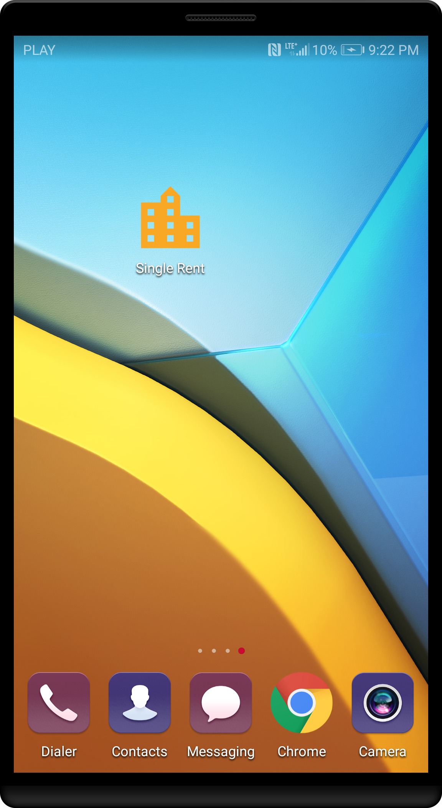
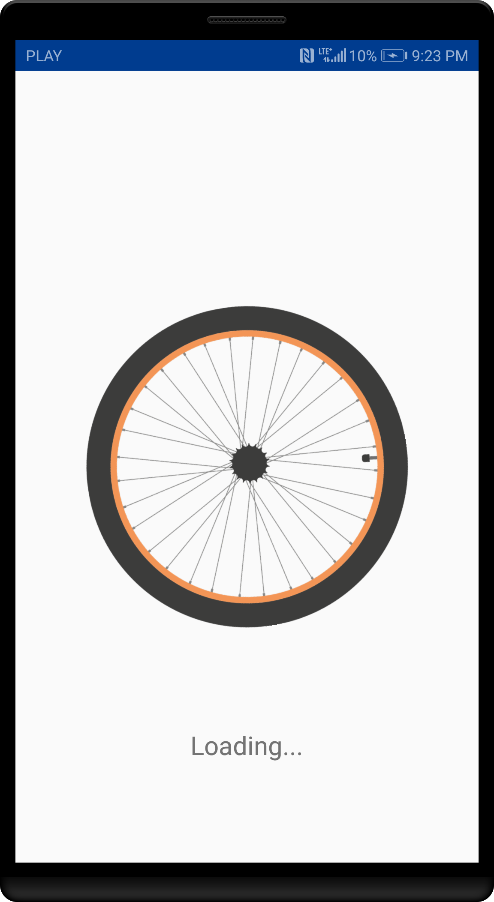

SingleRent is sample Android application created for vehicle rental purposes. 
It helps to manage all the processes connected with automatic rental, such as:
* finding available vehicle
* making reservation
* starting rental
* finishing rental
Application provides registration and login form as well.

## Register

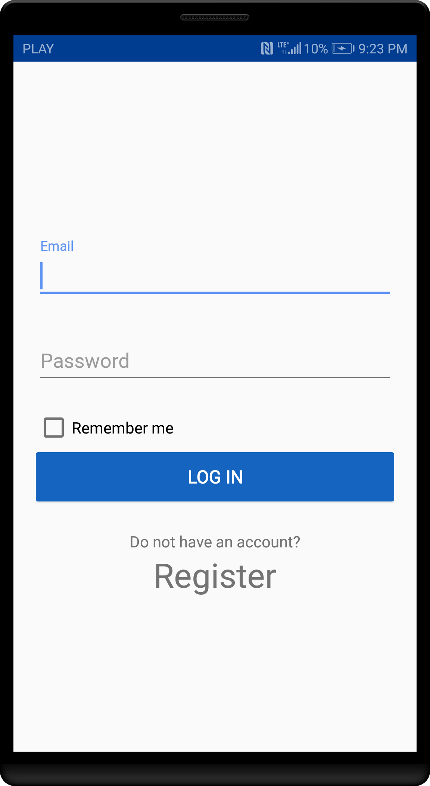
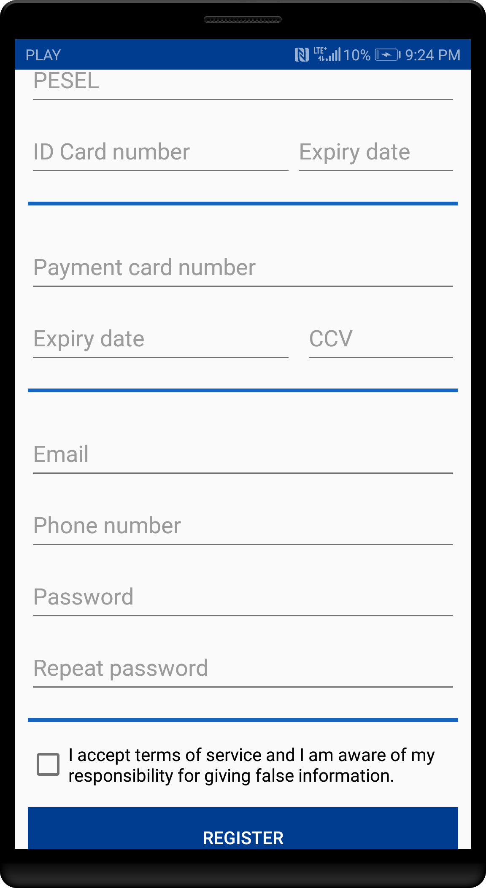

## Login

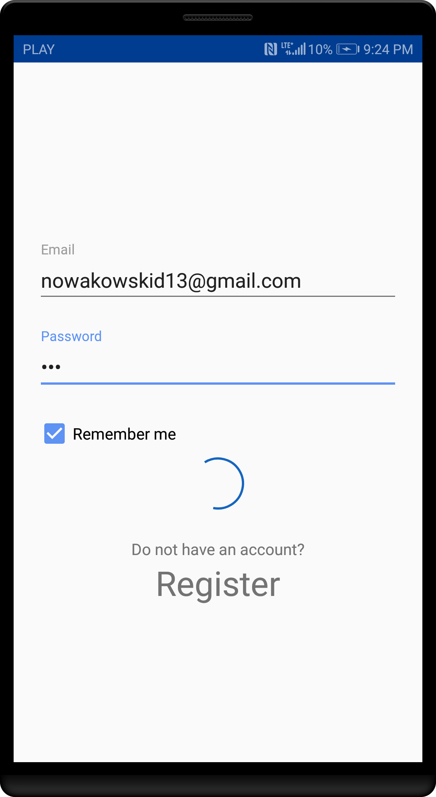
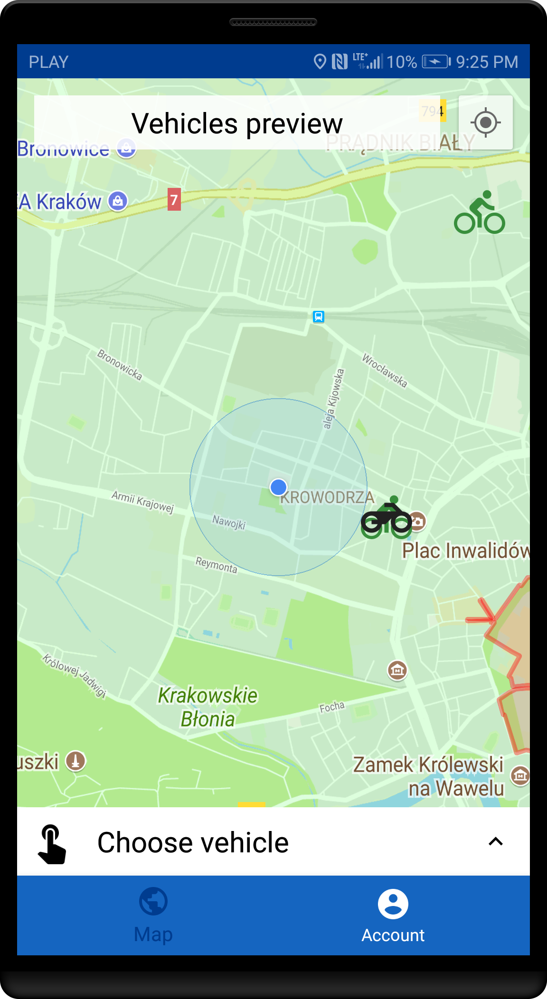

## Find available vehicle

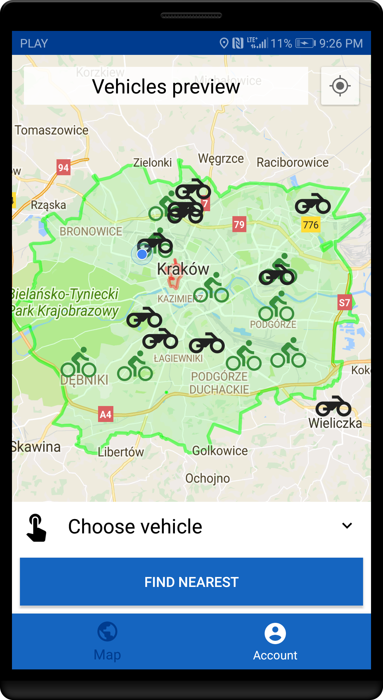
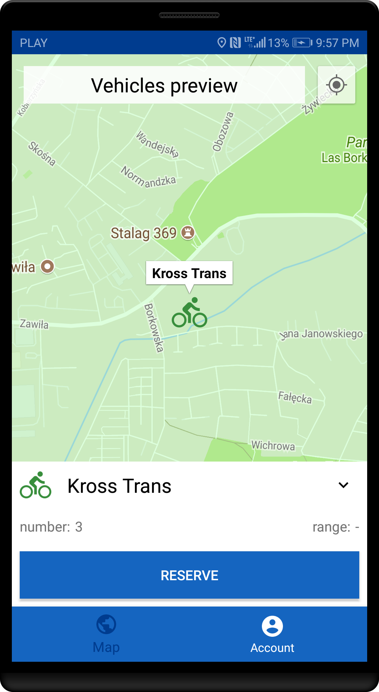

## Reservation

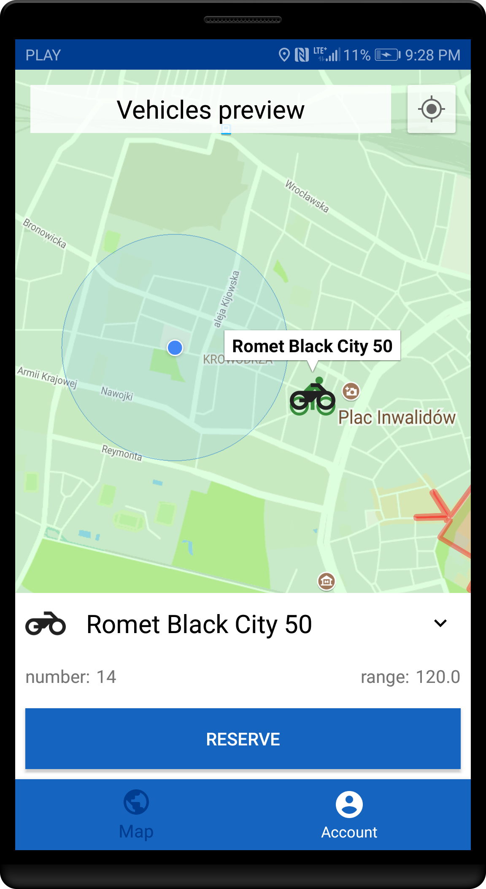
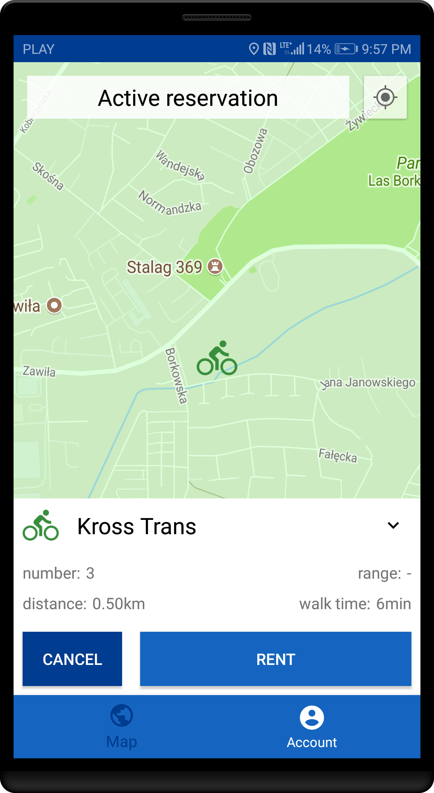

## Rental

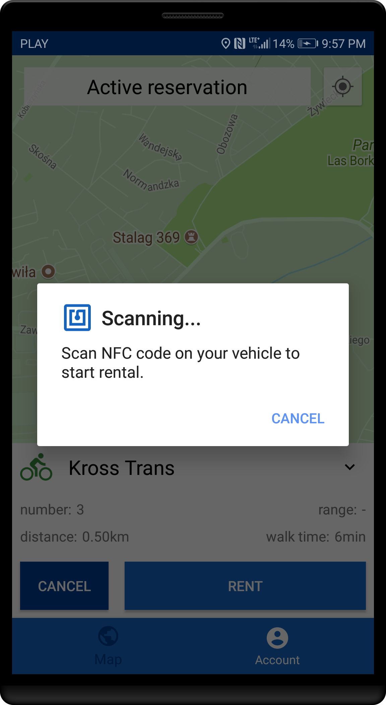
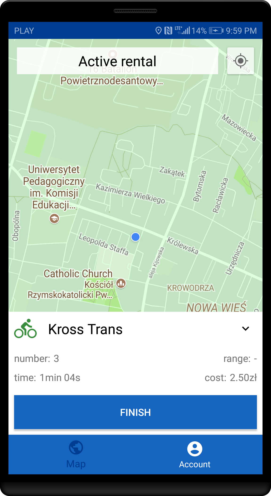

## Finishing

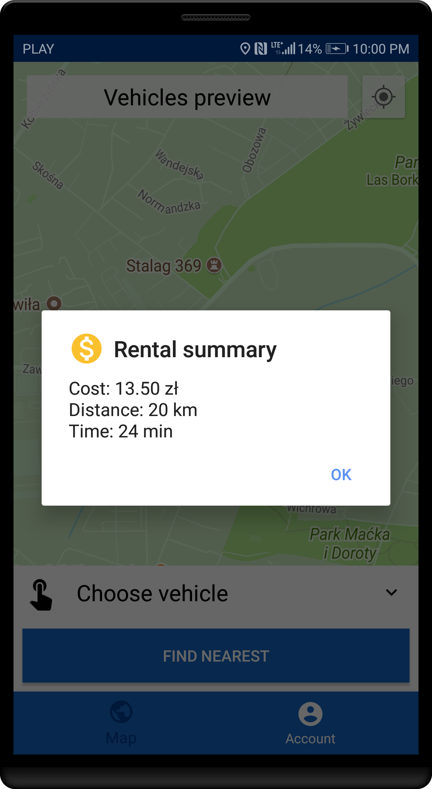

## Account edit

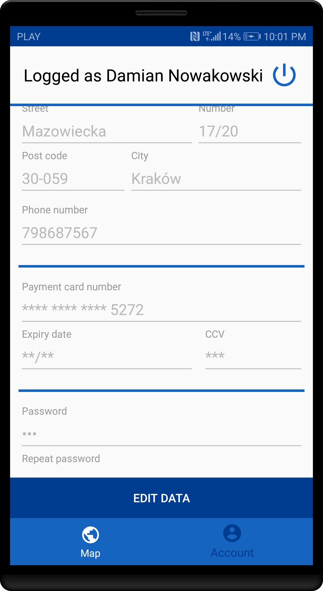
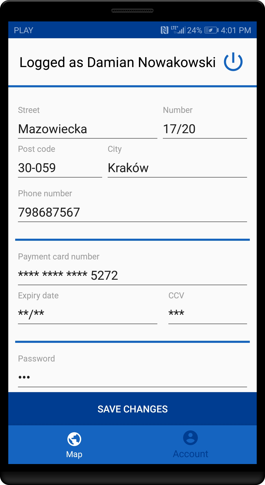

